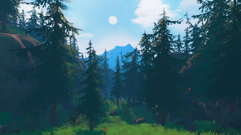
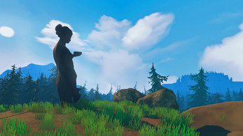
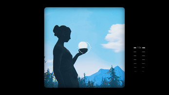
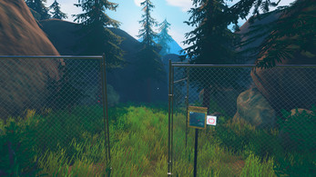

In Capture, a university project, I worked as the game designer and producer. Collaborating with 2 teammates, we created a first-person puzzle game centered around taking pictures to solve challenges. The unique mechanics drew inspiration from The Witness and "picture modes" present in games. We also successfully presented the game at various cons, winning a pitch competition at Comic Con and winning an award for Best Art, and being nominated for Best Game at the PlayStation Awards Portugal. This project highlighted my skills in conceptualizing unconventional game mechanics and managing the production process.

<!-- I also made this trailer! :D
<iframe width="560" height="315" src="https://www.youtube.com/embed/Rc5axouaJug?si=-fXLLTd2OC89pfEd" title="YouTube video player" frameborder="0" allow="accelerometer; autoplay; clipboard-write; encrypted-media; gyroscope; picture-in-picture; web-share" allowfullscreen></iframe>

Check the game out on [itch-io](https://oxstudio.itch.io/capture)

    -->