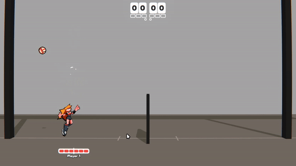
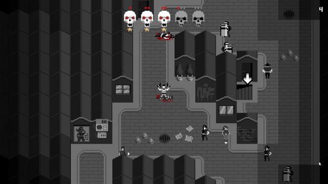

Spike is a personal project, 2v2 volleyball game influenced by fighting games.
Currently the team is comprised of 1 Game Designer and Programmer (me), 1 Artist, 1 Additional Programmer (AI Behaviour) and 1 Sound Designer and Composer. The game is still very early in development as we are all working on it in our free time.

 <!--  -->
