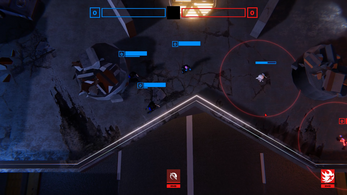
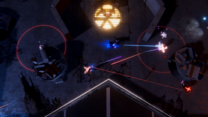

Motivated by a desire for diverse learning experiences, Neokai emerged as a third-year project with the same collaborators from Capture. Seeking a stark contrast to our previous endeavor, we ventured into the development of a top-down competitive online shooter. My roles as a **Producer, Game and UI designer**, coupled with **Gameplay Programming**, allowed me to engage in character game design, player testing, and balancing. This project served as a deliberate exploration into a completely different genre, reinforcing the importance of adaptability and comprehensive project planning in game development.

Check the game out on [itch-io](https://oxstudio.itch.io/neokai)

 

<iframe width="560" height="315" src="https://www.youtube.com/embed/uAxn4gAbK_8?si=Pz53aBHnh-V6D8Yo&amp;start=39" title="YouTube video player" frameborder="0" allow="accelerometer; autoplay; clipboard-write; encrypted-media; gyroscope; picture-in-picture; web-share" allowfullscreen></iframe>