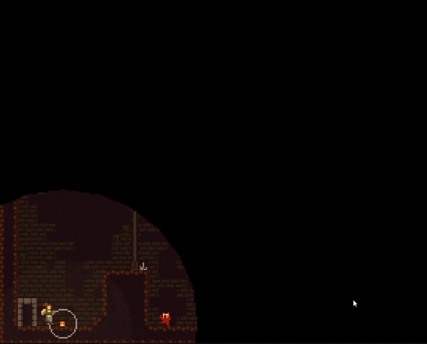
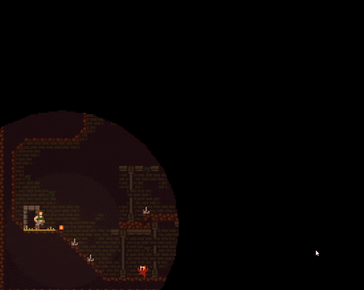
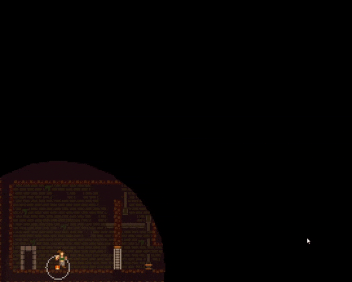

Only One Light emerged from a game jam, where I handled all **game design** and **programming** using GameMaker. The platformer's unique concept involved juggling a ball as the sole light source. The focus on a small, polished portion taught me the value of simplicity in game jam projects. Although reflecting on it now, I would tweak the movement/juggling mechanics, the experience greatly influenced my current work on a work in progres project with similar mechanics.

Check the game out on [itch-io](https://joaosdev.itch.io/only-one-light)

  