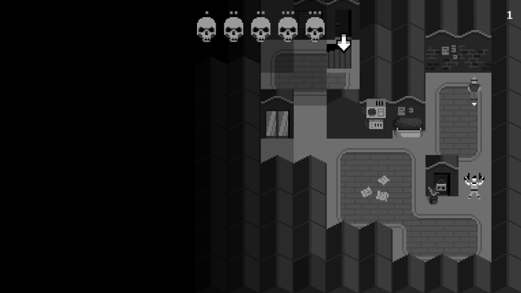

Terry's Tragedy, a winning entry in the Weekly Game Jam, explored the theme "you are the villain." In this top-down grid turn-based puzzle game, players navigate levels with the challenge of reaching an exit without causing harm to bystanders, leading to increased police aggression. In this project, where I worked on **game design** and **programming**, I tried designing gameplay mechanics that evoke emotions independently, without relying on a predefined story or context. Later, the addition of a story/context layered on top further heightened the emotional impact.

Check the game out on [itch-io](https://nabonabo.itch.io/terrys-tragedy)

<!--   -->
